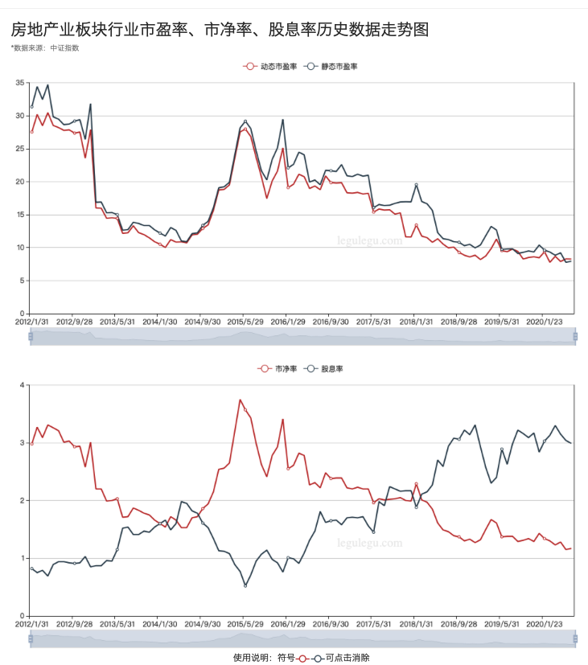
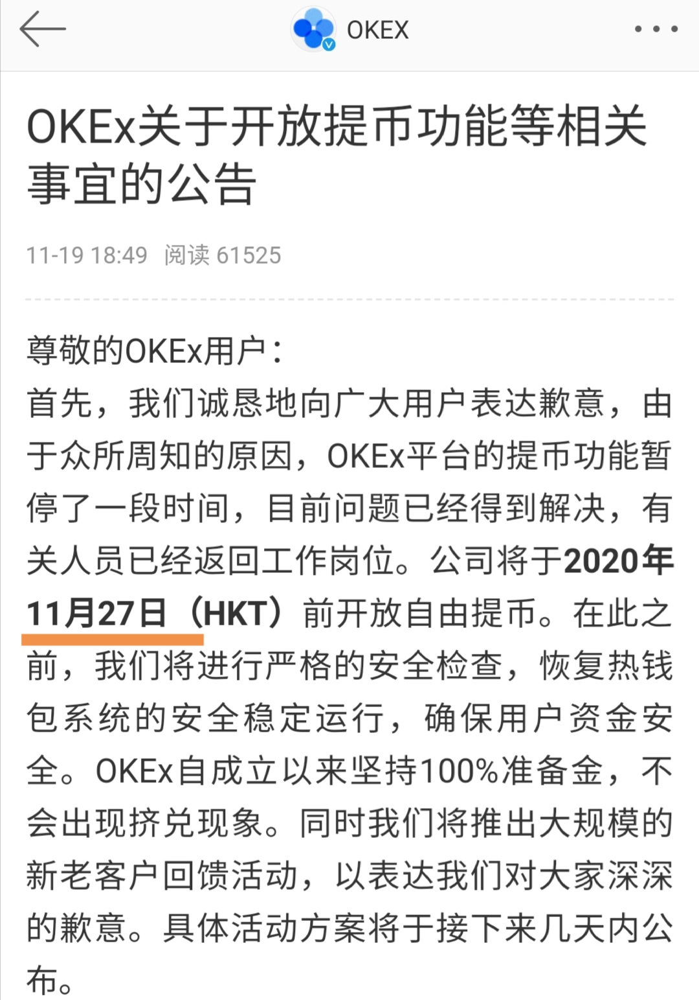

# waynett投资备忘录

1. 中国楼市被限制，各种银行理财收益持续下跌（招行的一些稳定理财产品出现亏损），宝宝类收益已经跌至年化1.5%（😶，存在京东2w，一天收益才0.85，还不够一个茶叶蛋的价格了）。美国股市（纳指）持续创新高的情况下，怎么看待A股呢？感觉楼市如果被限制，各种钱放银行收益越来越少，虽然由于疫情关系导致失业，裁员降薪，一部分社会层次的人的收入减少，但是还有一部分上层富人、中产手里持有现金肯定是要找出处的。所以才会有深圳各种豪宅被抢购，同时银行被爆楼市断供的秋水共长天一色的诡异情况。美国的股市最稳定，按常理中国应该最保值的是楼市，但是现在各种限制的情况下，资金热钱大概率往股市进行转移了。

2. 建行借贷部门刚刚给我打电话说可以年化4.8%进行5w额度的贷款，这种低利率的情况下，银行业务员直接打电话给客户这种事情本来就很少,房贷消费贷各种被限制，银行只能通过其他的贷款业务获取最大的收益，这个说明银行确实有大把的资金，但是却可能不愿意借贷给实体企业，钱都在银行内难以放出去。说明疫情情况下实体企业确实很难，同时因为疫情下的放水，导致资金充足，资金都在寻找获取收益的地方。

3. 经济危机中，各种资产暴跌(参考比特币2020.3.12的暴跌)，满地都是黄金，满地都是低价的筹码，这样的情况下，各国政府一般采取的措施就是放水刺激经济。虽然危机中，各阶层的人都会资产大缩水（我的理解是，谁手里的资产越多，那么相对缩水就更严重，所以，资产暴跌中，谁最先卖出资产，就能更大的保留实力，虽然资产变现后，因为放水刺激会有一定程度的稀释效应，但是相比不理性的资产抛售带来的快速贬值缩水，这部分可以忽略不计，穷人本身没有什么资产，所以相对来说应该影响不大，但是部分中产阶级可能因为经济危机而沦为穷人阶层，把握这样的机会，可以很好的实现阶层跃迁），但是金字塔顶层的阶层，能在资产触底后，以最低的利率拿到资金（高信用人群，可以更低代价的获取更多的信贷），从而以最低的价格获取到市场上低价的筹码。放水的情况下，资金的流动就像水面中投入石头，最中心离钱最近的一部分人就能最先获得资金，从而享受资产升值带来的收益，而离波纹中心最远的一部分人，则拿到资金的时候已经资产价格涨起来了，当他们购买资产的时候往往成为"韭菜"。放出来的钱从中心传导到最边上需要时间，资产从中心到边缘，被各种买买买而升值，而这种时候市场上流入了更多的水，水涨船高，资产价格被抬高到一个新的高度。2020-06-22 14:12:46

4. [行业市盈率查看](https://legulegu.com/stockdata/industry) 点击指标值可以进入趋势图，按照行业市盈率是否处在低点可以指引投资。如下面的[中证金融业](https://legulegu.com/stockdata/industry/zjh/J) 和[中证房地产业](https://legulegu.com/stockdata/industry/zjh/K),可以看出当前阶段金融行业市盈率已经处于低位。2020-06-30 14:13:03

  

  
  
5. 马太效应可以很好的应用在投资中，优秀的标的(苹果、Amazon，Google，Tencent,Alibaba，茅台，特斯拉，BTC)，大部分投资的都是优秀的投资个人和机构，他们在眼光上比一般人看的远，聪明的人都已经帮你做好选择了，你需要做的就是和聪明的人一起变强，强者恒强。

6. 一个投资博客：https://ljf.com/archives/

7. 2020年0726：比特币突破1w美金大关

8. 2020年0727，黄金突破历史高点，1921美金每盎司.美联储继续放水1w亿美金，疫情继续反弹，加上中美局部摩擦加剧，美派军机靠近中国领空，蓬佩奥发表类似于丘吉尔的铁幕演说，中美互关领事馆，盛传把中国踢出swift支付体系，吴锡进谈到核威胁，大有冷战脱钩的味道。
   

9. 2020年0727晚上，继黄金新高后，比特币大涨14%，最高到达11394美金。比特币表现了和黄金同样的属性。地缘危机+无限放水，应对危机（塞浦路斯事件，欧盟和德国打着反洗钱的幌子，对存款人增税的方式来应对塞浦路斯的债务危机。塞浦路斯的储户人人自危，争先把本国货币换成比特币，比特币短短几天从30多美元飙涨到265美元）。
   
   
10. 币安IEO（类似于股市的打新），当持有的BNB越多，分配到的签数越多，当手头持有的签数越多时，即使单个中签率低，签数多也能保证每次中签概率很大。
  

   如果p = 10%的中签率的话，

   ​      如果5个签，  中至少1签概率为：
$$
   1- (1-0.1)^{5} = 40.95\%
$$
   ​      如果10个签，中至少1签概率为：
$$
   1- (1-0.1)^{10} = 65.13\%
$$
   ​      如果20个签，中至少1签概率为：
$$
   1- (1-0.1)^{20} = 87.84\%
$$
   ​      当签数为20的时候，基本上大概率会中签。

   ​       

   ​       如果20个签，中至少2签概率为（1- 一个都不中 - 中一个概率）：$1 - （1 - 0.9）^{20} - C_{20}^{1}0.1 * (1 - 0.1)^{20 - 1}  $ = 60.8%

   ​       如果：20个签，按照每个签50BNB,23美金算的话，需要：20 * 50 * 23 = 23000美金 =  16w左右

   ​      如果按照10倍的收益率的话（200美金中签额）：2000美金，单次IEO收益率接近 2000 / 23000 = 8.6%。

   从上面分析可以看出，当签数越多，参与打新资金越多，可以明显提高中签概率(5个签、10个签，到20个签概率提升明显)。当然，因为投入资金越多，风险越大，风险与收益是成正比的（比如如果某一天Defi的去中心化交易成为主流交易方式，那么就会挤压很大一部分Cefi的价值）。风险在于BNB价格的变化，如果BNB能长期成长的话，收益是非常可观的（BNB收益+IEO收益,双杀）。

11. 比特币2020年312大跌，一天跌幅接近50%，合约爆仓100亿，从8000美金跌到最低4410$，313早上继续探底到3782美金（币安交易所数据），但是最低价其实场外溢价短时间溢价率甚至超过10%，所以按照最低3782价格计算，实际上认可的最低价值为3782 * 1.1 = 4160，usdt场外溢价指数：https://www.qkl123.com/chain-index/1401

    

12. 币安IEO投资思考——智猪博弈

    如果某次中了IEO，在高收益的刺激下，就会想着能够获取更多的签，从而一夜暴富，然而，就是这个时候，就开始出问题了，你要获取更多的IEO收益，就会买更多的BNB，这个时候你就从小猪变成了大猪，博弈的角色发生了变化，能让利给小猪，必然有人利益受损，当市场玩的人多的时候，资金足够撑起市场，可以不断地推高BNB的价格，这个时候小猪、大猪都是赚的，其中最大的受益者是IEO中签的的小猪，源源不断的增量资金不断地抬高价格。当市场玩的人少的时候，资金不够撑起市场，资金会不断的流出市场。根据2/8规则，不可能让持仓的大猪受益，那么只能让持有80%的大户亏损，让部分20%的散户收益来维持IEO的运行（平台要通过IEO来持续获取流量，部分IEO中签的就是他们口碑流量的推动者）。这个时候，每次IEO出来，当大量散户抢着持有BNB参加IEO的时候，BNB价格会上涨，就应该抛掉BNB，不去和小猪争夺食物。这样的市场，很适合波段。等持仓快照结束的时候，再接回来。从而让BNB数量增加。2019年8月9日

13. Defi火热的情况下，各cex交易所为了各平台引流，必然会通过上各种defi项目，拉高项目价格来吸引用户交易（在经过了uniswap这种一级市场挖坑私募，到中心化交易所，价格已经涨了很多倍了，这个时候中心化交易所也很难，必须成为项目的接盘方，对于交易所，流量为王，某种情况下，不惜通过自有资金拉盘）。在市场火热的情况下，有增量资金入场，则可以不断地推高价格，交易所+大户+散户不断地资金入场，每个人都盈利，但可以预见的当后期资金不足已推动价格上涨的时候，最后接盘的肯定是亏的最惨的一批人。资本市场的2/8规则永远存在。2020年08月31日。

14. Defi中的uniswap去中心交易所的价值在于，你可以在手握自己资产的情况下，不需要kyc，既可以自由交换tok

15. en，而不用担心中心化交易所(如fcoin)某天跑路导致资产丢失。同样，defi中的Lend，MakerDAO这种去中心化借贷平台的好处在于，你可以在手握自己资产的情况，不需要kyc，就可以进行借贷，而不用担心renrenbit这种中心化借贷平台会跑路倒闭（赵东被抓）。     

16. 比特币期货的主要作用是用来进行套期保值，而不是用来投机暴富。只有散户才会进行赌博式的高杠杆合约期货，这个市场永远是机构收割散户，很少机构会主动给散户抬桥子。机构投资主要在于稳定收益，而和散户期待的一夜暴富不同。当上涨到达前期高点或者强压力位时，机构为了维持现有的收益，会选择期货套保，等行情明了，突破压力位并稳定后解除套保。2/8格则就是，散户往往是被收割的对象。

17. 币圈利好兑现是利空，大资金在大幅盈利情况下一定要止盈止损。BNB从18刀一路上涨到33刀，涨幅83%（合约一路加仓7880usdt，合约盈利30%）。本来在33刀合约止盈一部分的，但是以为bsc智能合约会让bnb生态带来裂变，同时这个时候不断有好消息（支持bnb lauchpool多挖），会突破前高38，所以贪婪下，放弃了止盈。后面一路下跌，又没有止损（后面bsc上面的面包项目割韭菜外带BEL挖矿到期上线，利好出尽+利空消息）

18. 美股上市公司最近不断有购买btc的，["在购入2.5亿美元比特币之后，在纳斯达克上市的商业公司MicroStrategy上月再次购买价值1.75亿美元的比特币。"][https://www.okex.com/academy/zh/2020100700025065697440-2/]

     ["**支付平台Square周四10.8宣布，该公司已经购买了5000万美元的比特币，这是该公司在加密货币方面更大投资的一部分。Square共购买了4709枚比特币，该公司表示，截至第二季度末，这占其总资产的1%左右。**" ][https://www.cnbeta.com/articles/tech/1038083.htm] ,总量总共才2100w的市场，不断地有大资金入场购买比特币，比特币的新高只是时间问题。

19. defi中有大量的稳定币在赚取收益，这些稳定币的量级足以支撑起btc的牛市，只不过这部分资金还没有进入btc的市场。这部分自己一部分是稳定投资获取收益，但是也有一部分资金会溢出购买比特币，比如，收益赚钱的资金定投btc等。再说资金已经进入市场，人性就很难控制，难免就会有人把这部分资金用来玩合约，做对冲功能等，这些都会在比特币大涨的情况下，成为进一步推动比特币上涨的燃料。

20. BNB的价值在于拥有海量的用户：BNB暂时持币地址数30w+，OKB 4w+ ,HT 1w+，用户是最大的价值支撑。拿这次defi挖矿来说，为什么OKB和HT不能像币安一样通过defi流动性挖矿来不断地给平台币赋值，因为这两个平台没有币安的用户基数，而且币安的筹码分散，更多的散户用户持有BNB，当赚钱效应出来的时候，这些散户就是币安品牌最大的口碑传(C)播(X)者。而火币这种筹码基本都被大户持有的，如果也搞类似的流动性挖矿，基本就是给很少的几个大户送钱。大户吃肉，散户只能喝点汤，所以压根就不能产生币安的这种网络口碑效应。海量用户和赚钱效应，两者结合，产生正反馈，海量用户，因为有赚钱效应在，就会吸引更多的用户来币安，海量用户数继续扩张。

    

    

21. BNB继续稳步价格上涨，平台币的龙头地位凸显，HT和OKB还在原地躺着。IEO+LaunchPool+基于BSC的Defi流动性挖坑，一套组合拳下来，市场上BNB明显不够用，币安上面的借贷利率已经年化超过100%，场外去中心化借贷BNB也非常高，距离历史新高也只有20%左右涨幅了。10月15日[火币](https://link.jinse.com/s/TiBo6)全球站发布了9月份HT运营月报。9月[火币](https://link.jinse.com/s/TiBo6)共销毁 394.06万个HT，约1861.59万USDT。销毁金额环比8月下降了20.1%。在去中心化dex和defi的冲击下，大部分人冲进defi挖矿浪潮之中，明显火币数据有些差强人意。作为龙头平台币的BNB，季度销毁也在这几天出来，这里预测下，应该环比上季度上涨20%+（期待打脸，被打脸，实际上环比）。

    

    
    
22. IEO结束了，场外cream BNB借贷利率还是奇高，可以从一个方面来考虑，那就是借贷的人通过借入bnb卖掉对冲bnb下跌的风险，当bnb下跌后再低位买回还借贷的bnb。实际上是一种做空bnb的方式。

23. 比特币开启了单独的行情，在美股跌（纳指跌1.65%），黄金横盘的情况下，比特币单独走出一波上涨行情（上涨3.74%,11505=>11795），这是否标志着比特币新的行情来临？（2020-10-19 ）

24. 比特币今年第4次突破12000美金.然而是通过大饼的吸血方式完成的（连以太都跌，defi币暴跌），这可能表明场内资金缺乏，大家把其他主流山寨资金抽到比特币上。有一种说法是，在牛市末期转熊的时候，币圈的落袋为安，有一种作法是把币王视为现金，或者叫抱团取暖（类似于A股行情不好的时候，大机构资金涌入茅台抱团取暖，不断推高茅台价值），如果后期主流山寨不跟涨的话，就要警惕这种风险。（2020-10-21 ）

25.  [支付巨头PayPal周三加入加密货币市场，允许客户使用PayPal买卖和持有比特币和其他加密货币。从2021年初开始，PayPal的用户还将能够使用加密货币在其网络上的2600万商家处购物](https://www.reuters.com/article/us-paypal-cryptocurrency-idUSKBN2761L6) LONDON (Reuters) - PayPal Holdings Inc joined the cryptocurrency market on Wednesday, allowing customers to buy, sell and hold bitcoin and other virtual coins using the U.S. digital payments company’s online wallets.”

    

26. 最近有个规律，白天国人砸盘，晚上老美拉盘，老美印的钱全部买资产了，当然这些大部分应该是欧美富人，无限印钞，担心法币贬值，只能囤比特币。国人没钱只能卖币，同时大部分比特币都是在中国挖出来的，矿工也有砸盘的动力，毕竟这个价格利润也不小（20201023）。

27.  JPMorgan Chase & Co.’s（摩根大通） JPM Coin to make a payment for the first time：According to an October 27, 2020 report by CNBC, Takis Georgakopoulos, JPMorgan's global head of wholesale payments, said that one of the bank's large technology clients was using JPM Coin commercially for the first time, sending payments around the world. The bank also said that it had established a new business line called "Onyx" with a 100-person dedicated staff, which will let the bank commercialize its blockchain and digital currency developments.

    摩根大通作为美国最大的商业银行，他推出自己的JPM Coin一年后，终于开始走向商用，直接将比特币从13200推到13850接近2019年新高。可以想象，后面将会有更多的银行和机构加入这块战场。（20201027)

28. 受欧洲疫情影响(德国封锁1个月，法国宵禁)，欧股大跌，德国DAX跌4.17%，美股三大股指跌幅都在3.5%左右，黄金跌1.6个点，布伦特原油跌3.8个点，恐慌情绪影响，而且比特币接近前高的背景下，比特币下跌接近1000刀（13857-12907）。比特币还是一种风险资产，不能独立于市场，之前有两次独立行情，确实是有利好消息支撑(PayPal支持比特币，美国全球CBDC政策明朗，摩根大通JPM Coin商用)。这就好比虽然大盘下跌，但是有个别个股因为利好消息，一样可以涨停是一样的逻辑。（20201028）

29. 比特币是新时代的科技产品，所以从本质上讲，可以把比特币当做最优秀的科技股看待。疫情下，全球低利率+无限量放水，推动了各种资产的暴涨，美国科技股（FAANG，特斯拉）不断地刷新新高，即使贸易战的情况下，中国的优秀的科技股也跟随了这一趋势（虽然比美股晚一段时间），如腾讯，阿里巴巴，美团，宁德时代，比亚迪，海康威视，在这样的情况下，比特币离前高2w刀，还有50%涨幅，如果按照科技股的逻辑，近期破前高概率很大，至于为什么比特币没有在美股科技股和A股科技股前面新高，应该还是投资受众相对小，机构入局晚，市场散户多的原因，然而资金总会发掘价值洼地，是金子总会发光，应该在不久的一段时间后就会迎来新高。（比特币期货加仓2300 USDT，价位13452.5）。（20201029）

30. 据CoinDesk消息，《伊朗日报》援引《伊斯兰共和国通讯社》（IRNA）的一篇文章，本周早些时候报道说，该国内阁已修订了有关数字资产的最新立法，以允许将加密货币用于伊朗中央银行（CBI）的进口资金，而就在去年，该国采矿业被合法化，但是该行业受到政府的严格监管，使其成为一个难以经营的司法管辖区。这一变化意味着伊朗合法开采的加密货币只有在用于资助从其他国家进口的货币时才能进行交换。根据IRNA的报告，矿工将在授权的限制内直接向CBI提供加密货币。随着该国遭受美国制裁和冠状病毒大流行带来的经济困境，加密货币在伊朗变得越来越重要。《伊朗日报》建议，使用比特币来支付进口货款可以帮助该国避免实施制裁，限制伊朗对美元的使用。后面应该会有越来越多的央视使用比特币作为资产储备。（20201030）

    

31. [赵长鹏、何一回应福布斯对币安美国虚假经营的指控：制造恐慌，无稽之谈 ](https://zhuanlan.zhihu.com/p/270192101)。BNB跌8个点(30-27.5) ，杜均火币7爷等和何一微信互怼。每次发生这种相互干架的事情的时候，BNB都会跌一波。

    

    

    

32. 从比特币最近两次的低点分析比特币挖矿成本，挖矿的成本也就是比特币的价值支撑点位：从月线实体上看，2019年1月份低点，3349美金， 2019年3月6410（这个有减半的成本），

    

    

33. 由于火币交易所大量usdt转移到bitfinex进行tron到eth转换，谣传火币出事，比特币从13750跌到13200附近，ht大跌，bnb开始因为新矿高位抗跌，但是后面也下跌7个点，从高位29.30跌倒27.10.(20201102)

34. 香港证监会CEO：香港特区政府将推出有关加密资产的牌照，所有的虚拟交易平台都将受到监管。(20201103)

35. 美国大选牵动全球，全球股市、原油、黄金、人民币汇率出现过山车行情，比特币也一样经历了过山车行情，市场需要的是一个稳定的环境，无论是民主党还是共和党当选，都希望尽快出结果，市场需要的是确定性。(20201104)

36. [据南华早报（South China Morning Post）消息，中国银联已经与韩国支付提供商Danal合作推出一款虚拟卡，该虚拟卡提供了加密货币作为支付选项，预计将于今年年底上市。持卡人可以通过Danal的虚拟资产钱包访问加密货币Paycoin，可在全球179个国家和地区的3000万银联商户上为商品和服务付款。Paycoin是Danal公司在2019年推出的一款基于区块链的虚拟资产，降低交易费用和缩短跨境交易结算周期是其两大优势，目前已经在Upbit、Coinone、Huobi Korea、Gdac和Liquid等加密货币交易所上线交易。](https://cointelegraph.com/news/china-s-unionpay-and-korea-s-danal-to-launch-crypto-supporting-digital-card)

37. ETH2.0 v1.0正式发布，创世区块将于12.1日开始，以太坊经过长时间的压抑，终于走出了自己的行情，从380拉升8个点，也带动了比特币一举突破14000。(20201104)

38. 受美国大选结果出来影响（最近的大涨，有部分避险资金买入的原因），1108凌晨比特币从15410跌到14344,跌幅达到7个点，也算是利好出尽的感觉，毕竟前期大家都期望拜登当选，现在出来了，自然也就利好兑现了。另外灰度在周六也刚好不能在市场买买买，导致这个上涨的因素没有，另外btc最近涨幅已经很大，回调也是一种可预期的选项。(20201108)
    

39. 美元不断地贬值，导致最近人民币不断升值(7.18到6.56)，升值幅度已经8.3%，早期如果高位买入usdt的，持仓usdt已经跌了8%，这就是最近大家都在讨论的，持有usdt空仓被割。这样的情况下，大概有很大一部分资金，是会购买btc的，这也是本轮牛市的一个原因，中国市场大量将usdt兑换为btc避险。在全球放水的环境下，btc本身作为资产就有大幅升值的基础，再加上中国市场，defi，又使大部分资金换成了BUSD USDT等稳定币对，这些资金是不可能亏损出局的，只能随波逐流，一起做大btc。(20201109)

40. 辉瑞及其合作伙伴BioNTech表示90%的有效性疫苗研发成功，石油+道琼斯指数 标普指数大涨（航空+酒店+银行），黄金+白银大跌，纳斯达克科技股普跌(Zoom云办公),因为科技股大部分受疫情影响小，线上即可完成，所以前期大部分资金都避险选择了科技股，从而促使科技股被高估。一旦线下渠道打通，那么将有大量抄底资金进入传统线下行业。从而出现资金从科技股往传统股迁移的现象。比特币受此影响，先是从15300拉涨到15854美金，然后一路下跌到14824美金。比特币也是一种线上价值交流通道，所以他可以和科技股对比。（20201110）

41. [中国第二大商业建设银行计划通过发售一只数字债券筹资不超过30亿美元，个人和机构投资者可以用美元或比特币在指定交易所买卖这只债券。](https://cn.wsj.com/articles/建设银行将发售数字债券，可用美元或比特币购买-11605074406)，具体来说，建设银行此次发行的这只数字债券将以ERC20代币形式在以太坊上发行，代币面值100美元，代币在交易所Fusang Exchange上市。这是国内大型商业银行发行的首支STO（Security Token Offering，证券型代币发行），可以预见后面将会有更多的金融机构加入比特币的金融创新中，利好比特币和以太坊。（20201112）

    

42. 这一轮牛市很大一个原因是去中心化交易所defi导致的从中心化交易所提币，大家都提到去中心交易所兑换其它Dex发行币(ETH)，或者提到自己钱包进行流动性挖矿。同时okex创始人徐明星出事，导致不能提币，火币CTO被抓，币安传被美国FBI调查，导致恐慌提币，宝二爷很多圈内的人都发出了提币运动，币从交易所流动到个人钱包，导致的一个后果就是，强制用户锁仓，直接减少了市场的抛压，交易所币很少，而灰度等大机构又需要从交易所购买币，这样少量的资金就可以很快的拉盘。（20201116）

43. [美国金融巨头花旗银行（Citibank）的一位市场洞察力产品全球负责人撰写了一份报告，借鉴了1970年代黄金市场和比特币之间的相似性，指出了比特币的周线图，并利用技术分析（TA）的先前高点和低点确定了到2021年12月318,000美元的目标](https://www.coindesk.com/citibank-bitcoin-gold-318k-2021)。（20201116）

44. 研究分析师Kevin Rook在推特爆料了一个截图，显示全球著名基金管理公司天桥资本正在向SEC申请投资提供数字资产数字资产敞口的基金。SkyBridge位于美国纽约，由Anthony Scaramucci创立，被称为“基金中的基金”，该基金通过把散户和机构投资者的资金投向知名对冲基金管理公司，从中收取提成。据称该基金资产管理规模已超过120亿美元 https://www.coindesk.com/scaramucci-skybridge-capital-bitcoin-altcoins。（20201116）

45. 花旗+桥水基金+灰度比特币持仓突破50w，机构的不断消息，在周六周末跌到最低15670后，周一持续上涨，晚间突破16880，往17000只差一步。虽然晚间受Moderna 94% 30天有效疫苗影响，黄金一度跌30美金，纳斯达克科技股也急跌，像极了上次的辉瑞疫苗。只不过这次，比特币选择了往上（20201117）。

46. 特斯拉下个月21号将加入标普500指数， 盘后价格涨幅已经超过了10%， 年初至今价格已经翻了4.95倍。同期， 比特币价格翻了2.3倍。资本市场中，体量越大，深度会越好， 机构资金更容易扎堆，进去出来，不会导致过多的滑点产生，是很好的财富储备工具。所以， 贵的可能更贵， 便宜的可能更便宜。在中国，茅台腾讯阿里就是这样的公司，在美国，以FAANG为代表。比特币正在朝着这个方向行走，当体量足够大的时候，就是富豪财团很好的财富储备工具，不会因为某个交易所的砸盘而导致很大的市场波动，避免了进入离开这个市场的时候产生的无偿损失，这是比特币相对于其他加密货币非常核心的一个优势，即比特币的财富储值价值。（20201117）

47. CI全球资产管理公司(Global Asset Management ("CI GAM") )提交CI Galaxy比特币基金的初步招股说明书,CI全球资产管理公司是加拿大最大的投资管理公司之一,CI Global Asset Management是CI Financial Corp.（TSX：CIX）的子公司，CI Financial Corp.是一家提供全球资产管理和财富管理咨询服务的独立公司，截至2020年10月31日，其资产约为2024亿美元。Galaxy Digital Capital Management L.P.是Galaxy Digital Holdings Ltd.（TSX：GLXY）（以下简称“ Galaxy Digital”）的子公司。 银河数码目前经营四个不同的业务线，包括：交易，资产管理，本金投资和投资银行。 Galaxy Digital的首席执行官兼创始人是Michael Novogratz。 该公司总部位于纽约市，并在芝加哥，旧金山，伦敦，东京，香港，开曼群岛（注册办事处）和新泽西州设有办事处。（20201117）

48. 2017年20000刀的比特币是泡沫，2020年20000刀的比特币没有泡沫。三年时间，比特币已经从散户投机暴富的工具变成机构和富人投资保值增值的工具。

    全世界80%的财富集中在20%的人手中，当富人开始关注比特币，比特币的刚性需求会远大于炒作需求，这是一个不可逆的过程。比特币最终会成为一种硬通货。 

49. 比特币正式突破17000美金，能不能站稳要看今晚情况，每次亚洲白天砸盘，老外起来就是拉盘。（20201117）
    

50. 世界最大对冲基金Bridgewater Associates创始人、亿万富翁Ray Dalio今天在推特上表示，针对[比特币](https://www.zilian8.com/tag/比特币)近三年来首次超过17,000美元，他可能错过了一些东西。

    

    Dalio此前曾表示，[比特币](https://www.zilian8.com/tag/比特币)不如黄金，无论是作为交换媒介还是作为储值手段都是无效的。

    本月早些时候，Dalio甚至声称，比特币很可能会被取缔，并补充说，加密货币不会像人们希望的那样成功。

    Dalio今天表示，他的分析可能是错误的，并希望得到纠正。

    他说道：“对于比特币成为有效货币存在的问题，我的看法很简单。作为财富储备，比特币不是很好，因为它的波动性很大，并且与购买价格几乎没有关联，所以拥有它并不能保护我的购买力。一旦比特币能够与政府控制的货币竞争，它可能最终被取缔。我无法想象中央银行、大型机构投资者，企业或跨国公司会使用它，如果我对这些事情预测错了，希望得到纠正。”

    Podcaster和Morgan Creek Digital联合创始人Anthony Pompliano在推特上回复说：“我已经解释了比特币，并说服了许多对冲基金同行购买它，同时也让美国公共养老金系统对该资产进行了投资。希望有机会向您解释并回答您的任何问题。”

    虽然Dalio坚持自己的立场，就目前而言，他声称世界各国政府更有可能禁止比特币，而不是采用比特币，但这是他第一次承认自己可能并不了解比特币。

    Jamie Dimon和Michael Saylor等前比特币看空者最近转而看好比特币，这可能影响了达利奥的分析。当前的牛市行情与2017年的FOMO狂潮也截然不同，支撑当前价格走势的基本面要强劲得多。

    Dalio可能意识到了自己认知之外的比特币的价值，所以希望有人能够给他讲解，构建他的认知。

    Dalio的这番言论，进一步促使市场fomo，作为全球最大的对冲基金，正在的华尔街圈内大佬级人物。（20201118）

51. 墨西哥富商、零售业巨头 Grupo Salinas 创始人 Ricardo Salinas Pliego 发推向网友推荐[比特币](https://www.chainnews.com/projects/bitcoin.htm)相关书籍《The Bitcoin Standard》，并称这本书对可以加深对比特币的理解。Ricardo Salinas Pliego 表示，比特币可以保护公民财产免受政府没收，自己已将 10％的流动资产投资于比特币。链闻注，根据维基百科，Ricardo Salinas Pliego 是墨西哥排名第三的富豪，在世界排名第 110，到 2020 年 2 月，其的净资产约为 132 亿美元。（20201118）

52. 在51墨西哥富商购买比特币消息在内网传出后，比特币从11：30持续拉升，势如破竹，最高触及18476（12：54），并在13：30开始一波1000刀的暴跌，直接爆仓多仓接近20个亿，期权的最大好处就是它本身带有反脆弱特性，无论行情波动，不会被这种过山车插针行情影响。（20201118）

53. okex今天公告将于2020年11月27号前开放提币功能，这充分说明这次OKex事件和虚拟货币交易所无关，并不是为了打击咱们币圈。虽然一些人因为这次事件受到了影响。法律没有特意针对币圈交易所的行动，算是一个利好消息。同时利空出尽，应该也算利好，市场应该会朝着好的方向发展。（20201120）

    

    

    

    

    

